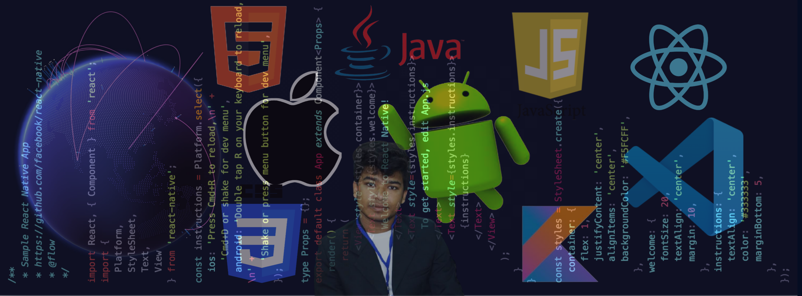

<h1 align="center">Hi , I am Md Sadiul Haque </h1>

 I have just kickstarted my career as a software enginnering intern with study Computer Science and Engineering Dept. at Dhaka International University,Bangladesh

<b>Visitor's Count</b>

 

### 🛠 &nbsp;Tech Stack

&nbsp;
&nbsp;
&nbsp;
&nbsp;
&nbsp;
&nbsp;
&nbsp;
&nbsp;
&nbsp;
&nbsp;
&nbsp;
&nbsp;
&nbsp;
&nbsp;

### :link: &nbsp;Connect with me

  
  
  
   
  

---
Credit: [Md Sadiul Haque](https://github.com/mdsadiulhaque)

Last Updated On: 10/20/2021
